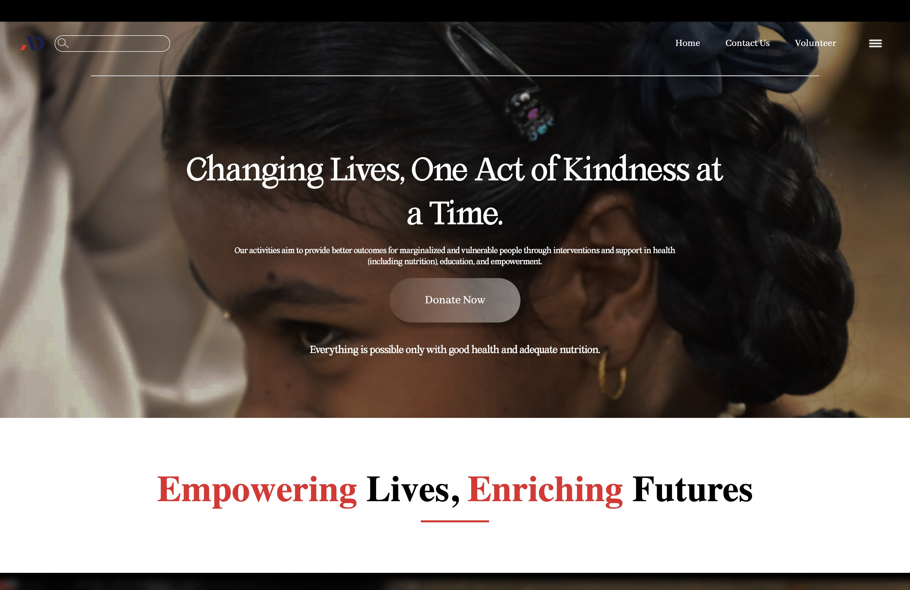
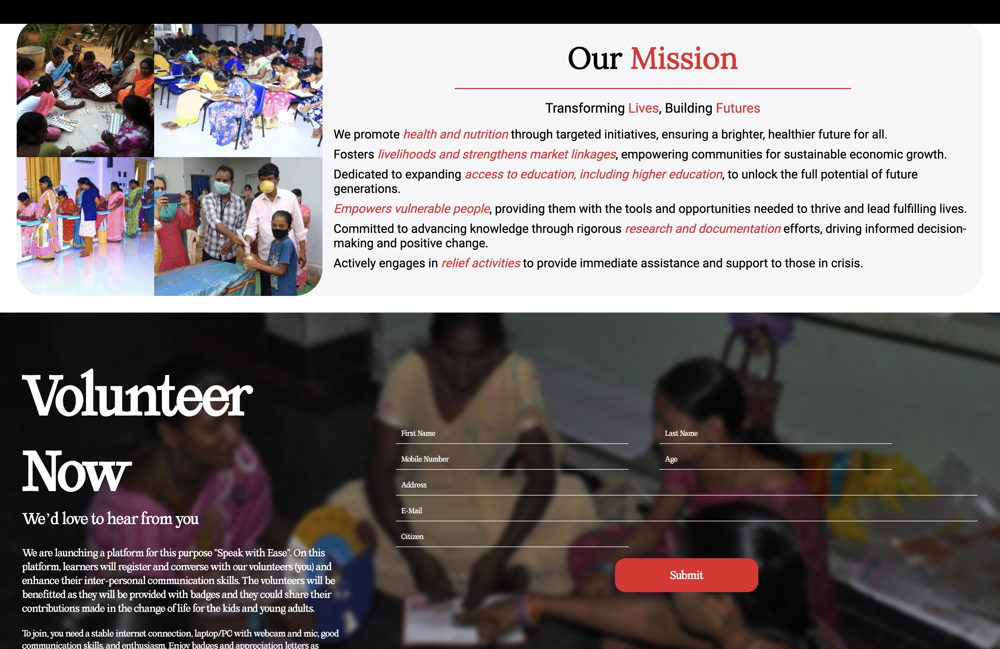
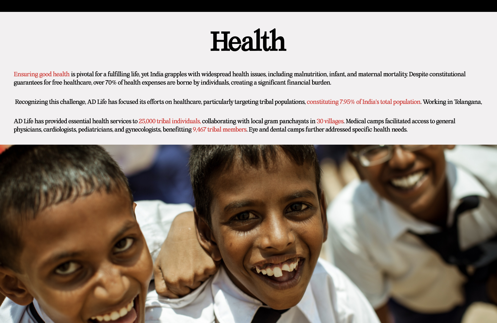

<h1>AD Life</h1>

Created A Website for AD Life Foundation
<h2>Technologies Used</h2>

<ul>
<ul align="center">

 
</ul>

</ul><h2>Features</h2>

<ul>
<li>Responsive Site</li>
</ul><ul>
<li>Clean UI</li>
</ul><ul>
<li>Smooth Animations</li>
</ul><h2>Screenshots</h2>

<h2>Setup</h2>

Clone the repo and view index.html
<h5>Steps</h5><ul>
<li><code>git clone https://github.com/TartejBrothers/AD-Life</code></li>
</ul><ul>
<li><code>cd AD-Life</code></li>
</ul><h2>Project Status</h2>

It is under progress, you can contribute to the project by finding issues or by creating new feature requests.
<h2>Contact</h2>

